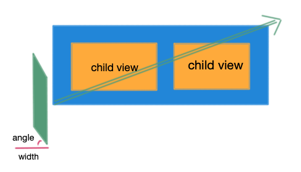

### StreamerConstraintLayout

带流光效果的ConstraintLayout


基于ConstraintLayout，可以放置任意子view。

### 使用

* step 1

```xml
    <com.qiesi.streamer.StreamerConstraintLayout
        android:layout_marginTop="20dp"
        app:sc_color="@color/color_streamer"
        app:sc_angle="45"
        app:sc_duration="1400"
        app:sc_skip_count="2"
        android:background="#41464F"
        android:layout_width="wrap_content"
        android:layout_height="wrap_content">
        any child view...
    </com.qiesi.streamer.StreamerConstraintLayout>
```

* step 2

```kotlin
    StreamerConstraintLayout.start()
    StreamerConstraintLayout.stop()    
```

### 可自定义的属性

|名称|说明|类型|
|----|----|----|
| sc_angle|角度 | integer|
| sc_width| x轴直角边宽度| dimension|
|sc_color | 颜色|color |
| sc_duration| 动画时间| integer|
| sc_skip_count| 执行间隔模数| integer|

### 思路图解

根据sc_width 与sc_angle 计算出 垂直方向边长


